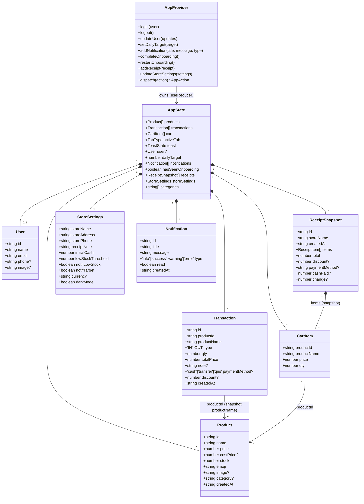
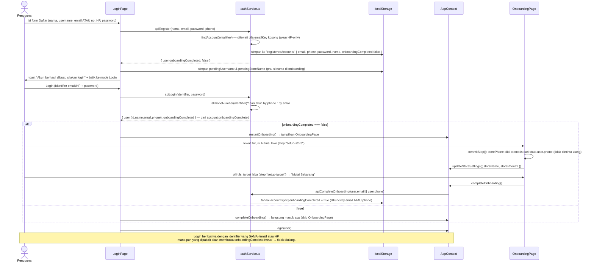
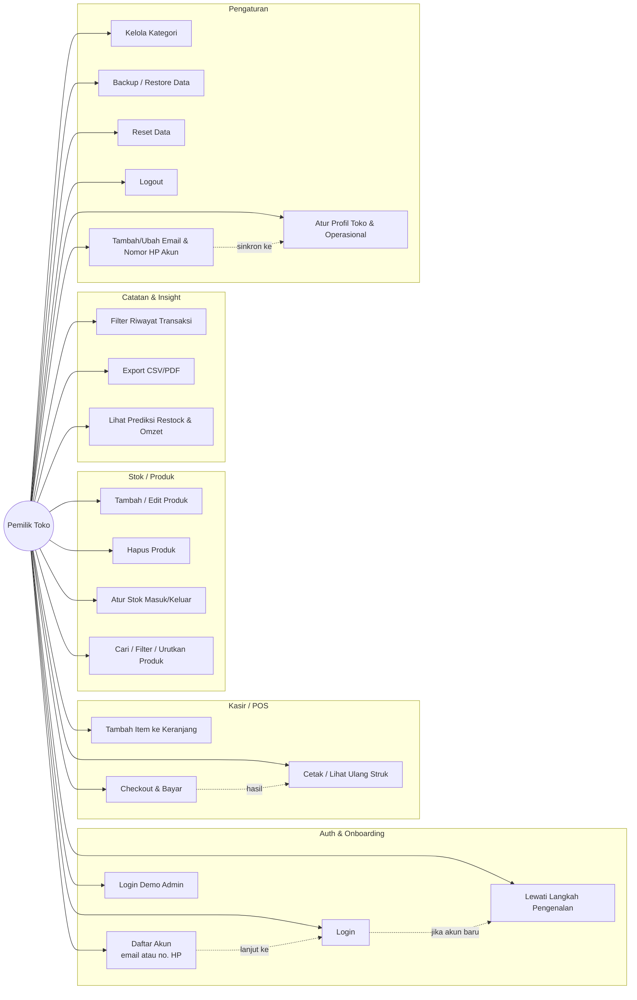

# LAKU — Codebase Guide (baca ini duluan)

> **Tujuan dokumen ini**: supaya sesi chat/AI baru bisa langsung paham seluruh
> aplikasi **tanpa harus membaca semua source code**. Dokumen lain di `docs/`
> tetap ada untuk detail spesifik (lihat [Peta Dokumen](#peta-dokumen) di
> bagian bawah) — dokumen ini adalah ringkasan + peta + diagram yang
> menghubungkan semuanya.
>
> Status: akurat per source code saat ini (frontend-only, auth Demo Mode lokal
> di `localStorage`, belum ada backend nyata).

---

## 1. Apa ini

**LAKU** — aplikasi web manajemen toko/warung untuk UMKM Indonesia: kelola
produk & stok, kasir (POS), catatan transaksi, insight bisnis, pengaturan
toko. Single-page app, responsif penuh (mobile/tablet/desktop), navigasi
**berbasis state** (bukan URL routing — meski `react-router` ada di
`package.json`, belum dipakai; lihat `constants/routes.ts`, masih scaffolding).

**Tech stack**: React 19 + TypeScript, Vite 7, Tailwind CSS 3 (warna hex
langsung, bukan token), lucide-react (ikon), jsPDF (export PDF). Komponen
shadcn/Radix UI tersedia di `components/ui/` (sebagian dipakai). Tidak ada
backend — semua data & auth jalan di `localStorage` ("Demo Mode").

```bash
cd Laku-responsive/app
npm install
npm run dev      # http://localhost:3000/Laku-App/
```

---

## 2. Peta Direktori (aktual, bukan boilerplate)

```text
Laku-responsive/app/
├── src/
│   ├── main.tsx                 # entry: StrictMode > ErrorBoundary > AppProvider > App
│   ├── App.tsx                  # splash → gate login → gate onboarding → layout+halaman
│   ├── styles/                  # globals.css, variables.css, themes.css, animations.css
│   ├── context/
│   │   ├── AppContext.tsx       # ⭐ SATU-SATUNYA state store aktif (useReducer + localStorage)
│   │   ├── AuthContext.tsx      # scaffolding, BELUM dipakai (AppContext yang pegang `user`)
│   │   └── ThemeContext.tsx     # scaffolding, BELUM dipakai (dark mode toggle belum ada UI)
│   ├── pages/
│   │   ├── Auth/LoginPage.tsx       # satu komponen untuk mode 'login' & 'register' (toggle)
│   │   ├── Auth/RegisterPage.tsx    # wrapper tipis: <LoginPage initialMode="register" />
│   │   ├── Onboarding/OnboardingPage.tsx  # 9-step wizard untuk akun baru
│   │   ├── Dashboard/DashboardPage.tsx
│   │   ├── Products/ProductsPage.tsx (+ ProductCard.tsx, ProductForm.tsx)
│   │   ├── POS/POSPage.tsx (+ Cart.tsx, Checkout.tsx)
│   │   ├── Records/RecordsPage.tsx
│   │   ├── Insights/InsightsPage.tsx
│   │   └── Settings/SettingsPage.tsx
│   ├── components/
│   │   ├── navigation/  TopNav.tsx · SideNav.tsx · BottomNav.tsx
│   │   ├── modals/      ModalSheet.tsx   (bottom-sheet mobile / dialog desktop)
│   │   ├── feedback/    Toast.tsx · ErrorBoundary.tsx
│   │   ├── branding/    Splash.tsx · LakuLogo.tsx · LakuWordmark.tsx
│   │   ├── forms/, tables/   # kosong (.gitkeep), belum dipakai
│   │   └── ui/           # ~40 komponen generic shadcn/Radix (button, dialog, card, dst.)
│   ├── services/
│   │   ├── auth/authService.ts     # ⭐ Demo Mode auth: register/login/onboarding lokal
│   │   ├── storage/storage.ts      # wrapper aman localStorage (readStorage/writeStorage/removeStorage)
│   │   ├── api/client.ts + endpoints.ts + interceptor.ts   # scaffolding fetch wrapper, belum dipakai (no backend)
│   │   ├── notification/index.ts   # scaffolding, no-op (notifikasi nyata di-generate di AppContext)
│   │   └── analytics/index.ts      # scaffolding, no-op (track() belum terhubung provider)
│   ├── hooks/
│   │   ├── useMobile.ts            # ⭐ useIsMobile/useIsTablet/useIsDesktop — dipakai luas
│   │   ├── useDebounce.ts          # siap pakai, minim dipakai
│   │   ├── useLocalStorage.ts      # siap pakai, minim dipakai (AppContext pakai storage.ts langsung)
│   │   └── useOnlineStatus.ts      # scaffolding, TIDAK dipakai di mana pun
│   ├── utils/
│   │   ├── currency.ts             # ⭐ SATU-SATUNYA sumber hitung uang (revenue/expense/profit/cash/format)
│   │   ├── date.ts                 # format & util tanggal ISO
│   │   ├── formatter.ts            # formatNumber/formatPercent/compactNumber
│   │   ├── helpers.ts              # cn() (tailwind-merge), generateId(), parseNonNegativeInt()
│   │   ├── feedback.ts             # haptic (vibrate) + beep audio saat checkout/notifikasi
│   │   └── string.ts                # capitalize/initials/truncate
│   ├── constants/
│   │   ├── storageKeys.ts          # ⭐ semua key localStorage (hindari typo string)
│   │   ├── routes.ts, roles.ts, permissions.ts   # scaffolding RBAC/router, BELUM ditegakkan di UI
│   └── types/                      # auth.ts, user.ts, product.ts, transaction.ts, index.ts (barrel @/types)
├── public/                  # manifest.webmanifest, sw.js (network-first, prod only), icons
├── tests/                   # e2e/ integration/ unit/ — semua masih kosong (.gitkeep saja, belum ada test)
├── android/, ios/           # folder kosong, BUKAN proyek Capacitor aktif (tidak ada config di dalamnya)
└── docs/                    # dokumen ini + dokumen lain (lihat Peta Dokumen)
```

> `lib/` (api.ts, finance.ts, storage.ts, utils.ts) yang disebut di beberapa
> dokumen lama **sudah tidak ada** — sudah dipecah ke `services/`, `utils/`,
> dan `types/` seperti di atas. Begitu juga `pages/Login.tsx` tunggal →
> sekarang `pages/Auth/LoginPage.tsx` + `RegisterPage.tsx`; `use-mobile.ts` →
> `hooks/useMobile.ts`; `components/Onboarding.tsx` →
> `pages/Onboarding/OnboardingPage.tsx`.

---

## 3. Arsitektur & Alur Data

```text
main.tsx
  └─ ErrorBoundary ─ AppProvider (state global) ─ App.tsx
                                                     │
                                       ┌─────────────┴─────────────┐
                                  !state.user                 state.user ada
                                       │                            │
                                  <LoginPage/>          !state.hasSeenOnboarding ?
                                                            │              │
                                                      <OnboardingPage/>  layout + halaman aktif
                                                                          (Dashboard/Products/POS/
                                                                           Records/Insights/Settings)
```

- **Sumber kebenaran state**: `context/AppContext.tsx` — satu `useReducer`
  besar (`appReducer`). Semua mutasi data (produk, transaksi, cart,
  pengaturan, user, onboarding, notifikasi) lewat `dispatch(action)`.
- **Sumber kebenaran uang**: `utils/currency.ts`. Jangan hitung uang manual di
  komponen — semua pakai `calcRevenue/calcExpense/calcGrossProfit/
  calcCashOnHand/formatRupiah`.
- **Persistensi**: tiap slice state (`products`, `transactions`, `receipts`,
  `cart`, `categories`, `user`, `dailyTarget`, `hasSeenOnboarding`,
  `storeSettings`) di-`useEffect` ke `localStorage` lewat `services/storage/
  storage.ts`. Key-key ada di `constants/storageKeys.ts`.
- **Auth**: `services/auth/authService.ts`, 100% lokal (Demo Mode). Tidak ada
  hashing password sungguhan — ini SENGAJA untuk demo, lihat catatan keamanan
  di file tersebut. `services/api/*` adalah scaffolding HTTP untuk backend
  nyata nanti (lihat `API.md`), belum terhubung.
- **Navigasi**: `state.activeTab` (`'dashboard'|'products'|'pos'|'records'|
  'insights'|'settings'`), bukan URL. `App.tsx` yang me-switch halaman.
- **Breakpoint** (`hooks/useMobile.ts`): Mobile `<768px` (TopNav+BottomNav),
  Tablet `768–1023px`, Desktop `≥1024px` (SideNav+TopNav, scroll per-halaman
  via `flex-1 min-h-0 overflow-y-auto`).

---

## 4. Model Data — Class Diagram



**Catatan penting model**:
- `Transaction.type`: `'OUT'` = penjualan, `'IN'` = pembelian/restock
  (`totalPrice` pembelian disimpan **negatif** untuk membedakan — lihat
  `currency.ts`).
- `User.email` **bisa string kosong** kalau akun didaftarkan via nomor HP —
  jangan asumsikan `user.email` selalu terisi (selalu sediakan fallback ke
  `user.phone` di UI, contoh: `Settings/SettingsPage.tsx`).
- Ada **dua definisi `AuthResponse`** yang sedikit berbeda: `types/auth.ts`
  (`User & { onboardingCompleted }`, ikut `image?`) vs interface lokal di
  `services/auth/authService.ts` (tanpa `image`). Tidak menyebabkan bug saat
  ini karena `authService` tidak mengirim `image`, tapi kalau menambah field
  baru ke `User`, perbarui **keduanya** — lihat [§7](#7-known-issues--keterbatasan).
- `Product.costPrice` opsional, default dianggap `0` saat hitung laba.

### Reducer Actions (AppContext)

| Domain | Actions |
|---|---|
| Produk | `ADD_PRODUCT`, `UPDATE_PRODUCT`, `DELETE_PRODUCT`, `ADJUST_STOCK` |
| Transaksi/Kasir | `ADD_TRANSACTION`, `ADD_TO_CART`, `UPDATE_CART_QTY`, `CLEAR_CART`, `ADD_RECEIPT` |
| Auth/Profil | `SET_USER`, `UPDATE_USER` *(payload: `name?/email?/phone?/image?`)*, `LOGOUT` |
| Onboarding | `SET_ONBOARDING_COMPLETE`, `RESET_ONBOARDING` |
| Pengaturan/Data | `UPDATE_STORE_SETTINGS`, `ADD_CATEGORY`, `REMOVE_CATEGORY`, `SET_DAILY_TARGET`, `RESET_DATA('demo'\|'empty')`, `IMPORT_DATA` |
| Notifikasi | `ADD_NOTIFICATION`, `MARK_NOTIFICATION_READ`, `CLEAR_NOTIFICATIONS` |
| UI | `SET_TAB`, `SHOW_TOAST`, `HIDE_TOAST` |

---

## 5. Alur Auth & Onboarding (paling sering berubah & paling rawan bug)



Alur ini (lihat `API.md` §0):
```
User baru : Buat Akun → kembali ke Login → Login → Onboarding → Masuk aplikasi
User lama : Login → Masuk aplikasi (onboarding dilewati)
```
berjalan benar untuk akun berbasis **email maupun nomor HP** — status
`onboardingCompleted` disimpan langsung pada record akun (`StoredAccount`),
dikunci oleh identifier yang dipakai user (email atau HP ternormalisasi),
bukan di tabel terpisah yang hanya mengenal email. Lihat §7 untuk catatan
mengenai akun **demo** (yang tidak tersimpan di `registeredAccounts` dan
karena itu tetap pakai fallback `onboardedEmails`).

---

## 6. Use Case

**Aktor**: *Pemilik Toko / Pengguna* (single-actor app — `constants/roles.ts`
& `permissions.ts` menyiapkan `owner` vs `cashier` tapi **belum ditegakkan**
di UI mana pun, jadi anggap satu aktor untuk saat ini).



### Tabel use case detail (alur kritikal)

| # | Use Case | Trigger | Precondition | Main Flow | Postcondition / Exception |
|---|---|---|---|---|---|
| UC1 | Daftar Akun | Klik "Daftar sekarang" → isi form → submit | Belum punya akun | Validasi nama/username/identifier/password → `apiRegister()` → akun tersimpan di `registeredAccounts` (`onboardingCompleted:false`) → balik ke mode Login, identifier terisi otomatis | Gagal jika email **atau** HP sudah terdaftar. Pengecekan keunikan email dilewati bila daftar via HP (`emailKey` kosong), jadi tidak ada collision palsu antar-akun HP-only |
| UC2 | Login | Isi identifier (email/HP) + password → submit | Akun sudah terdaftar (atau akun demo) | `apiLogin()` cocokkan kredensial via email **atau** HP → ambil `onboardingCompleted` dari record akun → `login(user)` → masuk Dashboard | Salah password/identifier → toast error, tetap di form. Status onboarding konsisten baik akun email maupun HP-only |
| UC3 | Login Demo | Klik "Masuk Demo (Admin)" | — | Login otomatis sebagai `admin@laku.id`, **selalu** memutar ulang onboarding (`restartOnboarding()` paksa, bukan dari status akun) | Masuk Dashboard dengan data demo bawaan |
| UC4 | Onboarding | Setelah login dengan `onboardingCompleted=false` | User baru login | 9 langkah: welcome → tur fitur (dashboard/produk/kasir/catatan/insight) → setup toko (nama + nama toko, nomor HP **otomatis** dari `user.phone` bila ada) → setup target harian → ready. Bisa "Lewati" kapan saja kecuali step terakhir | `completeOnboarding()` → `hasSeenOnboarding=true` tersimpan lokal **dan** `apiCompleteOnboarding(email\|\|phone)` menandai akun di `registeredAccounts` → login berikutnya tidak mengulang, terlepas dari email/HP yang dipakai |
| UC10 | Checkout POS | Item di cart → atur metode bayar/diskon → klik Bayar | Cart tidak kosong, stok cukup, (jika cash) uang ≥ total | Alokasi diskon proporsional per item → buat `Transaction` OUT per item → kurangi stok → simpan `ReceiptSnapshot` → toast + haptic/sound sukses | Gagal jika stok tidak cukup atau uang tunai kurang dari total |
| UC13 | Export Laporan | Klik "CSV" / "PDF" di Catatan | Ada transaksi sesuai filter aktif | Bangun file di sisi klien (tidak ada endpoint backend) — CSV langsung, PDF via `jspdf` (lazy-imported) | File terunduh dengan nama `laku-transaksi-<filter>-<tanggal>.csv/pdf` |
| UC17 | Backup/Restore | Pengaturan → Manajemen Data | — | Export: serialize `products/transactions/receipts/categories/dailyTarget/storeSettings` ke JSON. Restore: parse file → `IMPORT_DATA` + `updateStoreSettings` + `setDailyTarget` | Restore gagal → toast "Berkas cadangan tidak valid" (try/catch, tidak merusak data lama) |
| UC20 | Kelola Kontak Akun | Pengaturan → Akun → isi Email/Nomor HP → "Simpan Email & Nomor" | User login (email dan/atau HP boleh kosong) | `apiUpdateContact(current, next)` validasi format + keunikan → `updateUser({ email, phone })` → jika `phone` terisi, ikut `updateStoreSettings({ storePhone })` | Berguna terutama untuk akun yang daftar via HP (menambahkan email) atau via email (menambahkan HP); gagal jika email/HP baru sudah dipakai akun lain → toast error |

---

## 7. Known Issues & Keterbatasan

> Riwayat: review menyeluruh alur auth/onboarding (setelah validasi nomor HP
> ditambahkan ke login & register) sempat menemukan 4 celah logika — semuanya
> **sudah diperbaiki**: (1) status onboarding sempat hanya tersimpan per-email
> sehingga akun HP-only diminta onboarding ulang terus; (2) registrasi HP
> kedua & seterusnya sempat salah ditolak "Email sudah terdaftar" karena
> collision string kosong; (3) onboarding sempat minta nomor HP lagi walau
> sudah diisi saat daftar; (4) tidak ada cara menambah email untuk akun
> berbasis HP. Perbaikannya: `onboardingCompleted` kini disimpan langsung di
> record akun (dikunci email **atau** HP, lihat §5), `findAccount()`/
> `apiRegister()` melewati pengecekan email saat kosong, `OnboardingPage`
> mengisi `storePhone` otomatis dari `state.user.phone`, dan Settings → Akun
> punya field Email + Nomor HP yang tersambung ke `apiUpdateContact()`. Jangan
> kerjakan ulang perbaikan ini — verifikasi dulu ke source code sebelum
> menganggap ada regresi.

Keterbatasan/celah yang **masih relevan** saat ini:

- **Duplikasi tipe `AuthResponse`** — lihat catatan di §4. `types/auth.ts`
  dan `services/auth/authService.ts` mendefinisikan `AuthResponse` secara
  independen (yang di `authService.ts` tidak ikut field `image`). Tidak
  bermasalah sekarang, tapi berisiko drift kalau salah satu diubah sendiri.
- **Akun demo (`admin@laku.id`, `demo@laku.id`) tidak tersimpan di
  `registeredAccounts`** — jika login lewat form biasa (bukan tombol "Masuk
  Demo"), status onboardingnya tetap memakai fallback lama
  (`onboardedEmails`, key `ONBOARDED_KEY`), bukan mekanisme per-akun di §5.
  Tombol "Masuk Demo" sendiri **selalu** memutar ulang onboarding secara
  sengaja (`restartOnboarding()` dipanggil unconditional), jadi ini hanya
  relevan bila demo login dilakukan manual lewat form.
- **Tidak ada hashing password** — password akun demo tersimpan apa adanya
  di `localStorage` (`registeredAccounts`). Ini disengaja untuk Demo Mode
  (lihat komentar keamanan di awal `authService.ts`); **wajib** diganti
  hashing di backend nyata sesuai `API.md`.
- **RBAC belum ditegakkan** — `constants/roles.ts` & `permissions.ts`
  menyiapkan peran `owner`/`cashier`, tapi tidak ada UI yang membaca/
  menegakkannya; semua user yang login punya akses penuh ke semua halaman.
- **Modul scaffolding tidak fungsional** — `context/AuthContext.tsx`,
  `context/ThemeContext.tsx`, `services/notification/`, `services/analytics/`,
  `hooks/useOnlineStatus.ts` ada di source tapi tidak dipakai/tidak
  berdampak. Jangan kira fitur terkait (tema, notifikasi push, analytics,
  status online) sudah berjalan hanya karena filenya ada.
- **Fitur yang sengaja belum dikerjakan** (bukan bug) — lihat `ROADMAP.md`
  bagian "Belum Direalisasikan": skeleton loading state, dark mode toggle UI,
  pagination/infinite scroll di Records, keyboard shortcut global
  (`Ctrl+N`/`Ctrl+K`), i18n.

---

## 8. Ringkasan Cepat Per Halaman

| Halaman | File | State/aksi penting | Aturan bisnis kunci |
|---|---|---|---|
| **Login/Register** | `pages/Auth/LoginPage.tsx` | `mode`, `identifier`, validasi inline | Identifier = email **atau** HP (`isPhoneNumber()` di `authService.ts`); register **tidak** auto-login |
| **Onboarding** | `pages/Onboarding/OnboardingPage.tsx` | `currentStep` (9 step), `storeName/storePhone/dailyTarget` | 2 step interaktif (`setup-store`, `setup-target`) commit ke `AppContext` saat lanjut; sisanya murni edukatif |
| **Dashboard** | `pages/Dashboard/DashboardPage.tsx` | target harian inline-edit, modal kas | Progress target = `todayProfit / dailyTarget × 100`; semua angka dari `utils/currency.ts` |
| **Products** | `pages/Products/ProductsPage.tsx` (+`ProductCard`, `ProductForm`) | search/sort/filter, form tambah/edit, modal stok, konfirmasi hapus | Status stok: `0` = Habis, `≤ lowStockThreshold` = Hampir Habis; gambar maks 2 MB |
| **POS** | `pages/POS/POSPage.tsx` (+`Cart`, `Checkout`) | cart, metode bayar, diskon, riwayat struk | Diskon dialokasikan proporsional per item saat checkout; validasi stok di setiap penambahan qty |
| **Records** | `pages/Records/RecordsPage.tsx` | filter waktu/tipe/cari | Export CSV (sinkron) & PDF (lazy-import `jspdf`), nama file `laku-transaksi-<filter>-<tanggal>` |
| **Insights** | `pages/Insights/InsightsPage.tsx` | toggle 7/30 hari, klik batang chart | Urgency restock: stok=0 atau sisa<3 hari = high, <7 hari = medium; forecast = rata-rata 7 hari × (1+momentum capped ±30%) |
| **Settings** | `pages/Settings/SettingsPage.tsx` | accordion per section, satu tombol Simpan (+ tombol terpisah "Simpan Email & Nomor" di section Akun) | Section Akun bisa tambah/ubah email & HP via `apiUpdateContact()`; HP yang disimpan ikut menyalin ke `storeSettings.storePhone` |

*(Detail lengkap tiap halaman/komponen — props, semua handler — ada di
`DOKUMENTASI_PENGERJAAN.md`; dokumen ini sengaja meringkas supaya cepat
dibaca.)*

---

## 9. Peta Dokumen

| Dokumen | Kapan dibaca |
|---|---|
| **CODEBASE_GUIDE.md** (ini) | Pertama kali masuk project / sesi AI baru — gambaran utuh + use case + diagram + known issues |
| `ARCHITECTURE.md` | Ringkasan arsitektur singkat (lapisan, prinsip) — versi lebih pendek dari §3 di sini |
| `DOKUMENTASI_PENGERJAAN.md` | Detail per-halaman & per-komponen, changelog historis |
| `API.md` | Kontrak endpoint backend yang **akan** dibuat — wajib dibaca sebelum integrasi backend nyata |
| `ROADMAP.md` | Status fitur (selesai/belum), prioritas pengembangan lanjutan |
| `DEPLOYMENT.md` | Build, env, GitHub Pages, checklist rilis |
| `PATHS.md` | Peta folder versi singkat (skim cepat) |
| `info.md` | Catatan output tooling awal (Tailwind/shadcn setup) — bukan dokumentasi arsitektur |

Kalau dokumen-dokumen di atas saling bertentangan dengan source code, **source
code yang benar** — tolong update dokumen yang relevan saat ketahuan basi.
